# LargeST Spatiotemporal Lab

<p align="center">
  <!-- Optional banner image -->
  
</p>

<p align="center">
  <!-- Version -->
  

  <!-- Python -->
  

  <!-- License -->
  

  <!-- CI -->
  

  <!-- Stack -->
  
  
  
  
</p>

> **One‑sentence summary of the project.**  
> Replace this text with a concise description of the problem and solution.

---

## Overview

## Overview

<!-- 
  TODO: Describe the project's purpose.
  - Problem: What are you solving?
  - Solution: What model/system are you building?
  - Context: Who is it for? 
-->

This project implements **[ ... ]** to solve **[ ... ]**. It accepts **[ inputs ]** and produces **[ outputs ]**.

---

## Key Features

<!-- 
  TODO: List 3-5 key capabilities. 
  Examples: "Real-time inference < 10ms", "Daily retraining pipeline", "Streamlit dashboard"
-->

- [ ] **Feature A**: ...
- [ ] **Feature B**: ...
- [ ] **Feature C**: ...

---

## Repository Structure

```text
.
├── config/                 # Hydra configuration (single source of truth)
├── data/                   # Dataset layout (DVC‑tracked)
├── deployment/             # Docker, API, dashboards, k8s, Triton
├── docs/                   # Design docs, ADRs, figures
├── notebooks/              # Exploration & experiments
├── src/
│   └── spatiotemporal_lab/     # Production Python package
├── tests/                  # Unit & integration tests
├── tools/                  # Repo hygiene & CI tooling
├── dvc.yaml                # Optional DVC pipeline stub
├── pyproject.toml          # Dependencies & version
├── CHANGELOG.md
├── TEMPLATE_GUIDE.md
└── README.md               # You are here
```

---

## Installation

This project uses **PEP 621** (`pyproject.toml`).

```bash
git clone https://github.com/jtzanetatos/largest-spatiotemporal-lab.git
cd largest-spatiotemporal-lab


# Recommended
uv sync

# Optional: Install extras
uv sync --extra notebooks
uv sync --extra mlops

```

---

## Documentation

- **[TEMPLATE_GUIDE.md](TEMPLATE_GUIDE.md)**: Engineering patterns, training, configuration, and deployment.
- **[CONTRIBUTING.md](CONTRIBUTING.md)**: Development setup, coding standards, and testing.

---

## License

AGPL-3.0. See [LICENSE](LICENSE).
